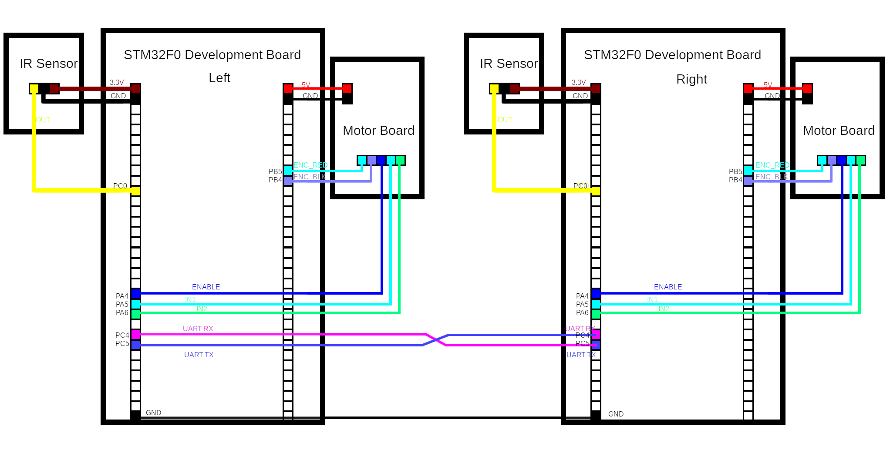

  
# line-follower
Line Follower Project for CS6780/5780
____
### Team
 - Brian Schnepp
 - Connor Cousineau

### Summary

This project implements a line follower based around two STM32F0 development boards, two sensor modules, two motors, and some other components. It is capable of detecting any line on a surface with black tape, and following it to its conclusion.

Information provided by both IR sensor modules can be used and compared to determine what direction and how fast to control the motor. The module provided converts the distance between itself and some distant object into a digital signal which determines if some dark object is present at that distance. This is used with some manual tuning of the sensors to have a consistent range check for the line below the robot.
For both STM32 boards, the output for the sensor modules is read as input in PC0.

### Bill of Materials
| Component  | Count  | Store Link  |
|---|---|---|
|2248 47:1 Encoder Motor|  2 |  https://www.pololu.com/product/4805 |
|STM32F0 Development Board|  2 |https://www.digikey.com/en/products/detail/stmicroelectronics/STM32F0DISCOVERY/3045359|
|IR Sensor|  2 |https://www.amazon.com/HiLetgo-Infrared-Avoidance-Reflective-Photoelectric/dp/B07W97H2WS|
|Wheels | 2 | https://www.amazon.com/Smart-Chassis-Motors-Encoder-Battery/dp/B01LXY7CM3/ref=sr_1_3?keywords=emo+smart+robot+car+chassis+kit&qid=1651531657&sprefix=EMO+smart+robot+%2Caps%2C129&sr=8-3 |
|Motor Drivers | 2 | See HW4 Solution |
|Chassis | 1 | 3D print or adapt acrylic frame & https://www.amazon.com/Smart-Chassis-Motors-Encoder-Battery/dp/B01LXY7CM3/ref=sr_1_3?keywords=emo+smart+robot+car+chassis+kit&qid=1651531657&sprefix=EMO+smart+robot+%2Caps%2C129&sr=8-3|
|Jumper Wires | 23 | https://www.amazon.com/EDGELEC-Breadboard-Optional-Assorted-Multicolored/dp/B07GD2BWPY
|Dark-Color Tape | 1 Roll | https://www.amazon.com/Gorilla-Tape-Mini-Travel-Black/dp/B01M2AAGTZ
| 12V AC Wall Adapter | 2 | https://www.amazon.com/TMEZON-Power-Adapter-Supply-2-1mm/dp/B00Q2E5IXW/
| USB Mini B Cable | 2 | https://www.amazon.com/Monoprice-15-Feet-Mini-B-Ferrite-105450/dp/B002KL8N6A/

### Wiring Diagram
The wiring diagram to set the board up is as follows:


### Detailed Setup and Usage
Once all required materials have been gathered, the system can then be set up.  Some tape may be necessary for additional structural security of certain components to the final board, e.g., a motor driver. The IR sensors should be secured to the front of the vehicle, with both sensors facing downwards toward the area where a line is expected to be seen. Both boards should be flashed with appropriate firmware for their placement: A macro ```right``` should only be defined in ```main.c``` for the right side board. Lastly, both wheels should be attached to a motor, and the motor then appropriately mounted to the chassis. It is then important to consult the wiring diagram for properly connecting each component together.

Once the project has been set up, the robot should be ready for usage. Draw some pattern on the ground, being careful to avoid excessively small or sharp distances smaller than about the diameter of one of the wheels, where the robot should follow. When both are sensing, the robot should continue straight. When only one sensor is detecting, the side with the sensor not detecting should have it's motor disabled. When both do not sense, then the robot should stop moving. Please consult the finite state machine diagram for a more detailed view:

The zip only contains files related to the motor driver. 

### Used Protocols and Peripherals
| Protocol/Peripheral  | Usage  |
|---|---|
| UART | Board-to-board communication |
| Timers | Control speed and activation of motors |
| Modeling | Guided software design and implementation |
| LEDs | Visualize intended direction of robot |
| Button | Debug functionality of sensor (removed in final result) |
| ADC | Retained current sense functionality |  

## Development Progress
The project began with the simple goal of creating a simple robot capable of following a single straight line. Overall, expectations were exceeded with the project, and more than the expected goals were achieved.

The first milestone was to implement and integrate the IR sensor module. A particular step was to either build the necessary component from scratch, or to evaluate different prebuilt modules. For the former method, some evaluation was done with a light sensor and some resistors to get a good quality signal out of it. However, as this would require placing breadboards and adding weight and unnecessary complexity to the project, a prebuilt module was evaluated.

For this first part, a sensor was chosen which had an integrated sensor and was able to send a signal. Due to some unexpected challenges in usage of the device however, it was not feasible to integrate it into the project. Instead, as it produced signals which were hard to analyze, a different module was chosen. This new module had a mechanism for selection of range, and a simple digital signal if something was within this range and absorbed the light. This was able to be re-integrated into the project fairly quickly, as the signal could be directly read by the STM32, and not require analysis of a pulsing signal which was difficult to detect with the logic analyzer, and thus be difficult to sense with either digital input pins or an ADC.

Next, driving the motors was required. Code from the motor lab was adapted with new setup code and some additional work from previous labs together to carefully control the motor. A core detail is that the motor labs required 6V for their motors, but the motors used for this project expect 12V input. Doing so quickly allowed for a much higher speed to be reached, along with more predictable control of the motor. Likewise, the motors were analyzed to see if the top gearbox could be removed to gain additional speed, which could be controlled in a more fine grained pattern with gears elsewhere, or even drive both wheels with a single motor with a servo. As more speed was not required for this, these options were not chosen, and the usage of one motor for both sides was retained.

A large challenge was to attempt to integrate both motors to use a single board, which found many troubled steps along the way. For a still unknown reason, it does not appear possible to use TIM15 for the board, which would be needed to drive a second motor's enable signal by an appropriate PWM. Instead, the usage of TIM2 was evaluated, which had similar problems as available pins would have conflicted with other pins in use at the time, as well as being needed for a different function should this work. Similarly, other timers were evaluated and had similar problems: either there existed pin conflicts or restricted the use of other pins which were desired, did not meet the goals of the PWM well enough, or were already in use with a different function. Thus, the project instead makes use of two separate STM32 boards, and information between them was shared via UART.

Finally, the entire system was brought together. Several different chassis were designed, 3D printed, and eventually integrated into the final project, aiming to build a complete whole project. This was done by careful evaluation of existing designs, modifications of existing designs, and custom designed mounts in some cases. For this project, an existing acrylic chassis and it's wheels were used to extend the base chassis already modified for this purpose, along with integration of mounting mechanisms to mount the IR sensors, STM32 development boards, and motor driver boards.

Overall, this project was worked on between 6 and 9 hours a week on average, with some additional work done elsewhere as necessary to complete specific milestones, with the final count being about 50-60 hours of work total. We believe this project is of excellent quality, and showcases a great technical achievement.
